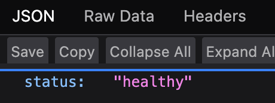
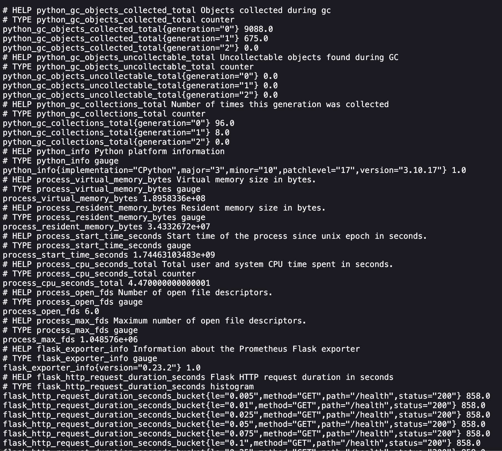
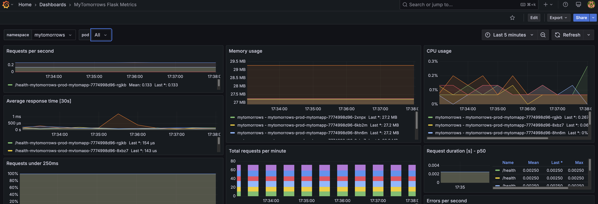

# myTomorrows Assignment - Sam Zammit 14/04/25

myTomorrows Assignment - Sam Zammit 14/04/25

**Assignment Contents**
  - [Assignment Spec](#assignment-spec)
  - [Acceptance Criteria / Overview of Design Decisions](#acceptance-criteria--overview-of-design-decisions)
  - [Environment](#environment)
  - [Code Structure](#code-structure)
    - [Python Flask App](#1-python-flask-app)
    - [Dockerfile](#2-dockerfile---click-here)
    - [Helm Chart](#3-helm-chart---click-here)
    - [Terraform](#4-terraform---click-here)
  - [Deploying](#deploying)
  - [Networking](#networking)
  - [Security, Scalability, and Availability considerations](#security-scalability-and-availability-considerations)
    - [Security](#1-security)
    - [Scalability](#2-scalability)
    - [Availability/ Fault-Tolerance](#3-availability-fault-tolerance)
  - [Observability](#observability)
    - [Flask Metrics with Prometheus](#1-flask-metrics-with-prometheus)
    - [Grafana Dashboard](#2-grafana-dashboard---click-here)
  - [Production and Onwards](#production-and-onwards)
    - [AWS Resource Access Control](#1-aws-resource-access-control)
    - [Automating Deployment to Different Envs using CI/CD](#2-automating-deployment-to-different-envs-using-cicd)
  - [Improvement Points](#improvement-points)
  - [Trade-offs](#trade-offs)

## Assignment Spec

### Acceptance Criteria / Overview of Design Decisions
- MyTomorrows Flask App Containerized
- Deployable via Helm chart
- Configuration is NOT hard-coded
- Secrets are encrypted with Helm Secrets (SOPS) using KMS
- App/IaC config is env. agnostic in Helm as well as Terraform
- Health-check and metrics endpoints introduced as best practice
- Custom-built Terraform module created for reusability
- Infrastructure-specific Helm values exposed to Terraform Module

In-depth description of design choice in sections below. 

### Environment
- Locally run Minikube cluster
- AWS ECR for Container register
- AWS KMS for Key-pair generation

### Code Structure
---


#### 1. Python Flask App - [Click Here](https://github.com/GTXSam/myTomorrowsAssignment/blob/main/docker/app.py)

The Assignment flask app was modified to include:
 1.  A `/health` endpoint which returns Status healthy when returning HTTP Code 200. Useful for application health-check and metrics.
 2. A `/metrics` endpoint through the `prometheus_flask_exporter` library which exports relevant Flask app. metrics relevant to our observability needs. These metrics are then scraped by Prometheus using a ServiceMonitor. Check the [Observability](#observability) section below for more info. 


#### 2. Dockerfile - [Click Here](http://https://github.com/GTXSam/myTomorrowsAssignment/blob/main/docker/mytom.Dockerfile)

1. A slim version of python was opted for as the base image, to reduce size.
2. Pip was used to install dep. Flask, jsonify & prometheus-flask-exporter.
3. Flask Port App Env Var set to default 5000, but is overwritten by the env. variable set in entrypoint.sh (Configurable in the Helm chart).
4. Entrypoint was used to execute flask app. This allows adding additional params.

#### 3. Helm Chart - [Click Here](https://github.com/GTXSam/myTomorrowsAssignment/tree/main/helm/mytomapp)

The Helm chart was written with practical functionality in mind.

A distinction between plain-text and encrypted data was made for DB_PASSWORD and SECRET_PASSWORD only to be exposed after SOPS KMS decryption.

**Templates**

- `deployment.yaml` - Deployment kind containing container image, port, env. variables referenced from ConfigMap and Secret kinds respectively for injection into the MyTom. app. Added health-check endpoint was used for both readiness and liveness probes.

- `service.yaml` - Service kind with a standard template. Cluster IP used in this case since the App is only exposed within the Cluster.

- `configmap.yaml` - As per assignment requirements, exposed env. variables were put into a config-map for an environment agnostic approach.

- `dbpass_secrets.yaml` & `seckey_secrets.yaml` - Secret kind for storing the sensitive env. variables. Referenced to values and only plain-text after decryption.

- `hpa.yaml` - Horizontal PodAutoscaler Resource for scability over a certain threshold in Deployment CPU/Mem.

- `poddisruptionbudgets.yaml` - Pod Disruption Budgets for minimum pod availability at any given time during scale-up, scale-down & deployment upgrades. maxUnavailable for not used in this case, since PDB was used to demonstrate the availability thought-process.


**Values**

The values were seperated per env. agnostically so they can be set/finetuned according to the specific needs. This includes:
- The image repo
- MyTomorrow's Flask App run and expose port
- Ingress and Service Type
- HPA values including enabled flag to enable/disable feature, and other flags exposed to **Terraform**
- PDB values including enabled flag to enable/disable feature, and other flags exposed to **Terraform**
- ConfigMap values exposed to the Flask app
- Secret values exposed to the Flask app (after SOPS Decrypt)


#### 4. Terraform  - [Click Here](https://github.com/GTXSam/myTomorrowsAssignment/tree/main/iac-terraform)

A [custom module](https://github.com/GTXSam/myTomorrowsAssignment/tree/main/iac-terraform/modules/mytom-helmdeploy) was written for this Assignment with the purpose of demonstrating the re-usability of Helm's provider with `helm_release`.

Apart from the standard params. exposed by this resource, the injection of specific values was introduced to manipulate infrastructure-scoped configuration exposed in the Helm values files. This being said, a concious desicion was made to leave application scoped-configuration confined to Helm values files. 

Infrastructure-scoped config exposed include:

- Environemnt-minded deployment naming. (Appending -test or -prod to the respective Deployment/s and Pod/s as per Env. )
- Controlling Replica count of deployment
- Enabling/Disabling HPA along with it's values to be parameterized
- Enabling/Disabling PDB along with it's values to be parameterized

Modules were then called in a standard `main.tf` file such as the following example:
```
module "mytomapp_prod" {
  source = "./modules/mytom-helmdeploy"

  mytom_env = "prod"

  #Override values.yaml set replica
  replicas = 5

  release_name  = "mytomorrows"
  chart_name    = "../helm/mytomapp"
  chart_version = "1.0.1"
  namespace     = "mytomorrows"
  values_path   = ["${file("../helm/mytomapp/values-prod.yaml")}"]
  repository    = "test"

  #Horizontal AutoScaling
  hpa_enabled = false #If False, hpa_minmax are ignored
  hpa_minReplicas = 1
  hpa_maxReplicas = 3

  #Pod Disruption Budgets
  pdb_enabled    = false #If False, minAvailPDB ignored
  pdb_minAvailablePDB = 3

  atomic          = true
  cleanup_on_fail = true

  #Force update over existing Chart
  force_update = true

  #Force release with same name
  replace_release = true

}
```

## Deploying


The Helm chart can be deployed by creating a new TF module block, decoding the values files when changing secrets, adapting the respective params. and applying it to state. **It is paramount to re-encrypt Values files.** 

``` 
terraform plan / terraform plan --target=module.MODULENAME
terraform apply / terraform apply --target=module.MODULENAME
```

For troubleshooting purposes. To check what Helm populates on hypothetical apply, we can perform a dry-run. Ex:

`helm template mytomorrows . -f values-prod.yaml --dry-run`

**Deployment Status**

We can check the status of the deployment through:

`kubectl get deploy -n mytomorrows -o wide`
`kubectl get events -n mytomorrows`
and by checking the pod logs. 

In this case the GET /health endpoint returns Status 200
`kubectl logs mytomorrows-prod-mytomapp-7774998d96-2xnpx -n mytomorrows`


A few considerations to keep in mind:
- Deploying a helm release with the exact name in the same namespace will error.
- Deploying a helm release with the same ConfigMap/Secret names in the same namespace will error. 

## Networking

**ClusterIP** was used in this case since this is a intra-cluster application that is NOT communicating with an external service/s.

## Security, Scalability and Availability considerations

### 1. Security
- AWS ECR was paired with ECR policy and custom Role used for Minikube to access the Private Container Registry.
- Environment secrets were encrypted with SOPS using KMS to prevent plain-text visibility in Git.

### 2. Scalability 
- HPA definitions were used to provide the opportunity to scale up the MyTomorrow's app if CPU reaches the threshold of 80%

### 3. Availability/ Fault-Tolerance
- With Pod Disruption Budgets, the minAvailability and maxUnavailable parameteres can ensure an adequate pool of MyTomorrows pods running at all times. In this case, minAvailable was used, so atleast x amount of pods need to be up during a chart upgrade, for example, until the application is deemed Available.
- *Not Implemented:* With Node Anti-Affinity, pods are distributed accross multiple-nodes for high-availability.

## Observability
### 1. Flask Metrics with Prometheus


Usually ServiceMonitorSelector in the Prometheus CR is modified to add the ServiceMonitor label to discover in Prometheus.

For provability's sake for this assessment, the MyTomorrow's Flask metrics ServiceMonitor has been appended with the Prometheus Operator Stack predefined label.

### 2. Grafana Dashboard - [Click Here](https://github.com/GTXSam/myTomorrowsAssignment/blob/main/prometheus)

An open-source Grafana dashboard was used and adapted for this Assignment. The dashboard includes variable labels filtered by namespace and/or pod. The metrics exposed are:
- Requests per second
- Average response time (30s)
- Requests under 250ms %
- Flask pod Memory usage per pod
- Flask pod CPU usage per pod
- Total requests per minute
- Errors per second (Verbose)


## Production and Onwards

The following networking considerations can be made to prepare this application to be production ready:
- Worker nodes across multiple AZ's and Adaquate Worker node spec used to deploy the application.
- Utilizing the AWS Load Balancer Ingress Controller CRD to provision AWS ALBs for the MyTomorrows Flask Application.
OR by using TargetGroupBinding Custom Resource with an external AWS ALB for Target group registration if ELBs are managed independantly.
- Making use of Security groups to limit access to/and from the application externally.
- If the application is internet-facing, the ALB Listener's should utilize the ACM cert for SSL and run on Port 443. Pods register to the respective Target Group.
- Resources such as Load balancer origins accessed externally ideally set up with a SSL domain.
- When scailing out the application to the internet AWS WAF may prove useful to block certain IP ranges/unusual patterns of traffic.

### 1. AWS Resource access control

A plausible approach to control access of AWS resources to a MyTomorrows Kubernetes app is by implementing IAM Role Policy with Kubernetes Service accounts.
1. Create an IAM Policy with scoped-permissions. With an Implicit deny, explicit allow mindset.
2. Create a respective Role.
3. Attach Policy with said Role.
4. Inside EKS, create a Service Account pointing to the ARM of the IAM Role
5. The service account can then be attached to the deployment to the AWS resource such as a DB (provided inbound secure groups allow)

### 2. Automating Deployment to Different Envs using CI/CD

There are multiple solutions to approach this. The newer convetional methods include GitOps principles to automate the deployment trigger.
These approaches can eliminate the need of using the Terraform helm provider entirely and focus Terraform on managing AWS resources.

Using ArgoCD:
-  ArgoCD can be set up on the cluster. An ArgoCD Custom Resource is created pointing to the respective MyTomorrows Helm value files to their environment/s. The Sync policy can be controlled from within the CR whether to automatically deploy changes to the Kubernetes cluster on commit to Git or manually intervened for more sensitive environements such as Alpha and Production.

Using GitHub Actions:
- With GitHub Actions, a Deploy workflow can be used to trigger an "on push" event when a push to said repo has been made.
This can trigger the workflow to deploy to a specific cluster provided the kube-config is configured on the GitHub Actions runner. The GH Actions runner should be able to reach the EKS Cluster. 

## Improvement Points
1. **Drawback: Helm-release provider resource does NOT detected a change in state after reflecting a change in the Helm templates. Currently the only official way forward is an increment in Chart version number.**

Workaround: A workaround is to create a TF module that generates a hash from the templates helm dir. This will change with any given change, which will in turn force a state change in TF on apply.

2. Node Anti-Affinity was not implemented due to a 1-node environment restriction. In a realistic scenario, pods should be distributed according multiple nodes to prevent downtime in-case of an EC2 Worker node crashing.

3. The addition of liveness and readiness endpoints has the Flask app taken longer to startup. Useful when dealing with Bootstrapping and goes with the principles of containerization.

## Trade-offs

1. Using Terraform to manage the Helm releases instead of CI/CD tooling. Blurring the lines of Infrastructure Management and Application Management.